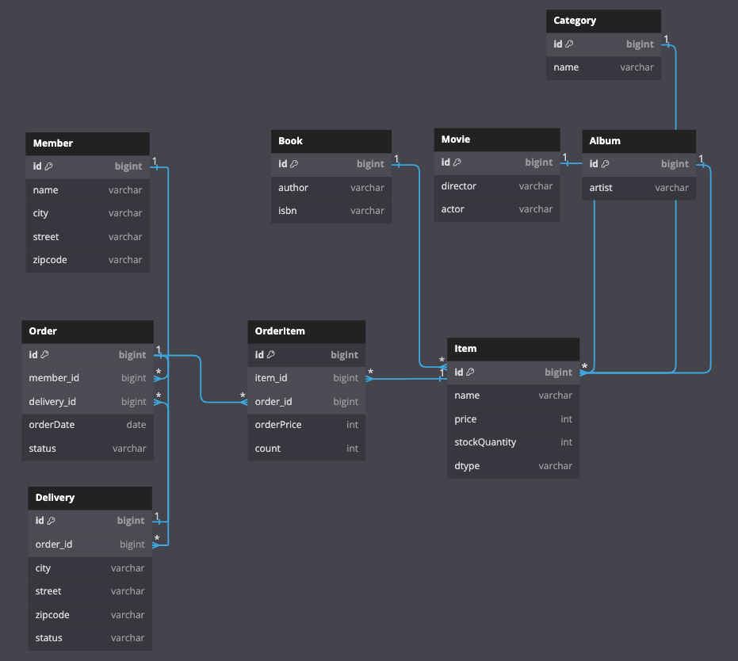

## Ecommerce Shop - JPA API

### JPA 학습 및 이해, 숙달을 위한 사이드 프로젝트

## 기능

- 회원 기능
  - [ ] 회원 가입 
    - 이름, 주소(도시, 주소), 우편 번호 입력
  - [ ] 회원 목록 조회
- 상품 기능
  - [ ] 상품 등록
    - 상품명, 가격, 수량, 저자, ISBN 입력
  - [ ] 상품 목록 조회 
  - [ ] 상품 수정
- 주문 기능
  - [ ] 상품 주문
    - 주문 회원, 상품명, 주문수량 (List로 제공??)
  - [ ] 주문 내역 조회
  - [ ] 주문 취소 가능, 
  - [ ] 회원명을 기준으로 주문한 사람 검색 가능. 주문 상태에 따라서도 검색 가능
- 기타
  - 상품은 재고 관리가 필요함
  - 상품의 종류는 도서, 음반, 영화가 있음
  - 상품을 카테고리로 구분할 수 있음
  - 상품 주문 시 배송 정보를 입력해야함.
---
## ERD 

---

